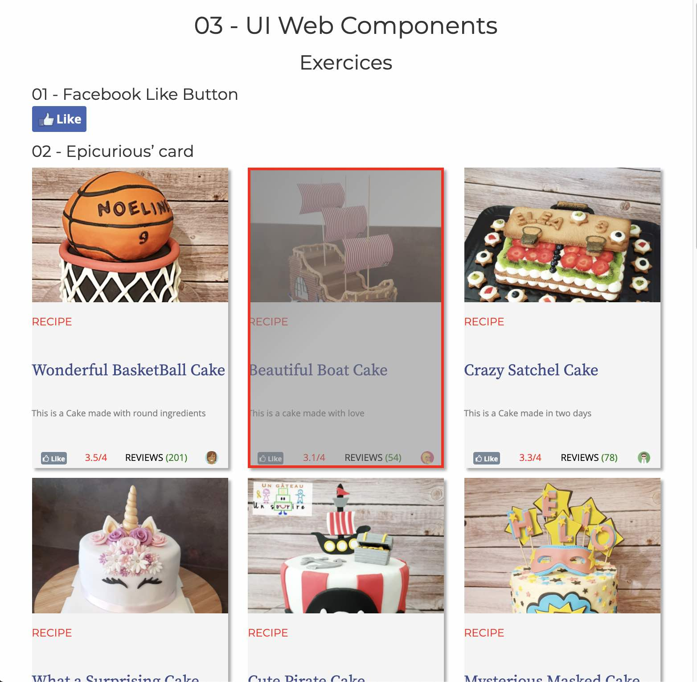
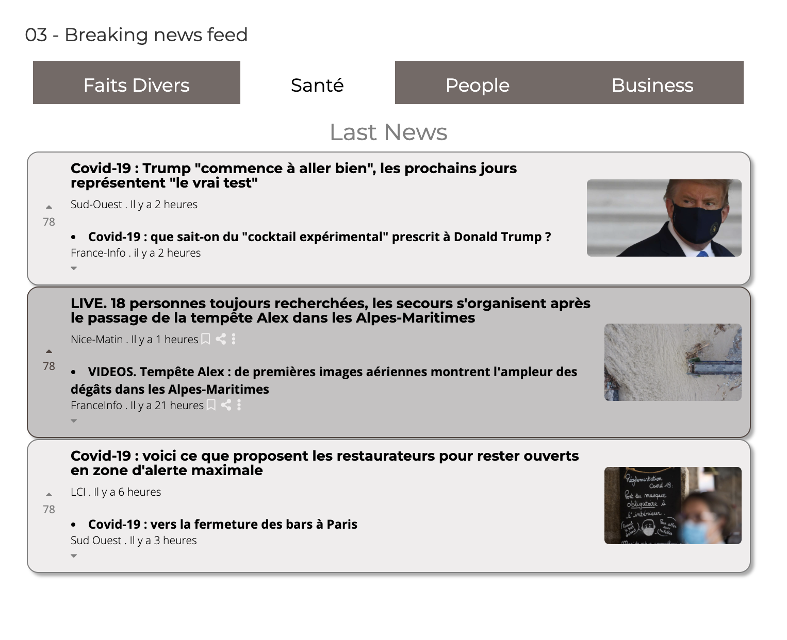

# Web Component
Now that you know the basics of HTML & CSS, let’s go a bit deeper into web design and CSS techniques.

  * Get used to thinking in terms of web components; UI elements you can combine to build your web pages.
  * Learn how to code your own CSS library of them! Having a cool library of components is the most powerful secret of frontend developers.

You can go through the slides [here](https://fr.slideshare.net/bpapillard/le-wagon-ui-components-design) 
If you’d rather watch this video en [français](https://www.youtube.com/watch?v=ewxMpl09OwE) 🇫🇷 you can go directly on Youtube.

## Main takeaways
#### What’s a component?
#### Organize your CSS with component files
#### Useful CSS techniques for building components

## Exercises
  * Design the Facebook Like button
  * Build an Epicurious’ card
  * Use flexboxes to design your own breaking news feed
  
 ## Results
 
 
 
  
 ## Resources
   * Bootstrap web components
   * UX components on codepen.io
   * Flexbox guide
   * Flexbox Froggy game
   
 ## Happy Designing 🎨 🎨 🎨